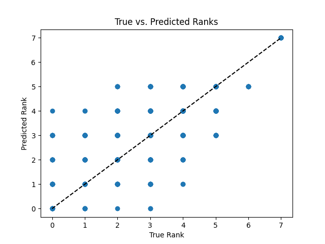

# Starcraft Player data prediction model

## Decision making process
I started my EDA by describing and showing the data. I specfically focused on the League index variable and its relationship with other variables in the dataset. I visualized it using histograms scatterplots and boxplots.

## Communication of findings

The accuracy of my predictions is only around 40-45% so there is a lot of room for improvement here. However given more time and data we could conduct more exploratory data analysis. We could also change our machine learning method and potnetially better tune our hyper paramaters to get a more acurate prediction. 

Below is a vaisual of our current predictions. The dotted line shows the predicted dots that are exactly accurate to the true rank.

If stakeholders want to provide extra data they should make sure to get a diverse range of candidates in different ranks to provide the model with a better range of accounts to predict